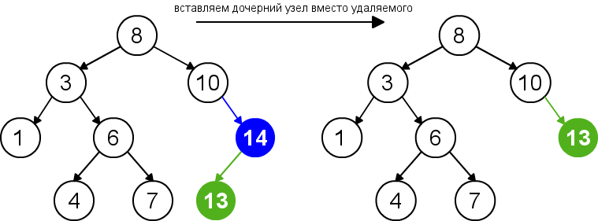

# Бинарное дерево поиска

**Содержание**

* [Бинарное дерево поиска](#бинарное-дерево-поиска-1)
    * [Поиск](#поиск)
    * [Добавление](#добавление)
    * [Удаление](#удаление)
    * [Реализация](#реализация)
* [АВЛ-дерево](#авл-дерево)
    * [Балансировка](#балансировка)
    * [Реализация](#реализация-1)
* [Прочие операции](#прочие-операции)
* [More](#more)

В ходе разработки ПО появляется потребность в такой структуре,
в которой мы можем относительно быстро добавлять/удалять любые элементы, что обычные массивы/вектора не могут,
при этом не занимающая гигабайты памяти, как хеш-таблицы

Пока в нашем утопичном будущем не изобрели самую лучшую структуру данных, умеющее все за `O(1)` и варить кофе,
на помощь приходит _бинарное дерево поиска_

## Бинарное дерево поиска

Источники:
[википедия](https://ru.wikipedia.org/wiki/%D0%94%D0%B2%D0%BE%D0%B8%D1%87%D0%BD%D0%BE%D0%B5_%D0%B4%D0%B5%D1%80%D0%B5%D0%B2%D0%BE_%D0%BF%D0%BE%D0%B8%D1%81%D0%BA%D0%B0),
[нирк](https://neerc.ifmo.ru/wiki/index.php?title=%D0%94%D0%B5%D1%80%D0%B5%D0%B2%D0%BE_%D0%BF%D0%BE%D0%B8%D1%81%D0%BA%D0%B0,_%D0%BD%D0%B0%D0%B8%D0%B2%D0%BD%D0%B0%D1%8F_%D1%80%D0%B5%D0%B0%D0%BB%D0%B8%D0%B7%D0%B0%D1%86%D0%B8%D1%8F),
[визуализация](https://www.cs.usfca.edu/~galles/visualization/BST.html)

**Бинарное дерево поиска** (Binary Search Tree, BST) - бинарное дерево, соблюдающее условия:

1) Ключ левого ребенка для любого узла меньше ключа его родителя
2) Ключ правого ребенка для любого узла больше ключа его родителя
3) Оба поддерева для каждого узла являются бинарными деревьями поиска

Пример такого дерева:

Для простоты будем считать, что наши деревья умеют хранить только уникальные объекты

Введем на дереве три ключевых операции: поиск элемента, добавление элемента и удаление элемента

### Поиск

Очевидно, что благодаря такой структуре, мы можем найти любой элемент в дереве,
следуя из корня, если применим такой алгоритм:

* Если ключ текущего узла меньше искомого - идем в правое поддерево
* Если ключ текущего узла больше искомого - идем в левое поддерево
* Если ключ текущего узла равен искомому - мы нашли элемент
* Повторяем, пока можем
* Если у узла нет больше поддеревьев - элемента в этом дереве нет

При размере дерева в `n` элементов, а высоте (то есть наибольшему пути от корня до листа) `h` поиск займет `O(h)`

Рассмотрим пример: поиск 4 в дереве

* Сейчас мы в корне `8`, `8 > 4`, поэтому идем в левое поддерево
* `3 < 4` - идем в правое
* `6 > 4` - идем в левое
* `4 = 4` - бинго

### Добавление

Действуя аналогично поиску мы можем добавлять элементы,
ища предполагаемое место, в котором оно могло бы оказаться, если бы было в дереве

Очевидно, что добавление займет `O(h)`

### Удаление

С удалением посложнее. Разберем 3 случая:

1) У узла нет детей - тогда мы можем беспрепятственно удалить его,
   и структура дерева не изменится

2) У узла есть только одно дитя - тогда мы можем удалить его,
   а его родителя напрямую соединить с его ребенком

3) У узла два ребенка - тогда находим следующий элемент за данным (то есть такой, имеющий наименьший ключ, больший
   данного) -
   такой элемент будет находиться в правом поддереве и не иметь левого ребенка,

Очевидно, что удаление займет `O(h)` - мы должны найти элемента за `O(h)` (в том числе найти следующий элемент
за `O(h)`) и произвести развязку за O(1)

### Реализация

* С++ - [binary_search_tree.cpp](binary_search_tree.cpp)
* Python - [binary_search_tree.py](binary_search_tree.py)

Итого имеем три операции:

| Операция   | Асимптотика |
|------------|-------------|
| Добавление | `O(h)`      |
| Удаление   | `O(h)`      |
| Поиск      | `O(h)`      |

Все бы хорошо, но! Рассмотрим пример - 2 дерева:

 

Их содержимое одинаково, но структура разная - поиск в первом дереве займет `O(h) ~ O(logn)`,
а поиск во втором `O(h) ~ O(n)` - что почти приближает нас к асимптотике массива.

Давайте при добавлении/удалении элемента будем изменять структуру дерева таким образом,
чтобы асимптотики были минимальными - `O(logn)`. Таким образом, мы подходим к...

## АВЛ-дерево

Источники:
[википедия](https://ru.wikipedia.org/wiki/%D0%90%D0%92%D0%9B-%D0%B4%D0%B5%D1%80%D0%B5%D0%B2%D0%BE),
[нирк](https://neerc.ifmo.ru/wiki/index.php?title=%D0%90%D0%92%D0%9B-%D0%B4%D0%B5%D1%80%D0%B5%D0%B2%D0%BE),
[визуализация](https://www.cs.usfca.edu/~galles/visualization/AVLtree.html)

**АВЛ-дерево** - бинарное дерево поиска, на которое мы накладываем еще одно условие -
разница высот двух поддеревьев для каждого узла не должна превосходить 1.

Таким образом высот поддеревьев будут _почти_ равными, поэтому операции будут совершать за `O(logn)`.
Чтобы соблюдать это условие, после добавления/удаления будем совершать "балансировку"

### Балансировка

**TODO**

### Реализация

* С++ - [avl_tree.cpp](avl_tree.cpp)
* Python - [avl_tree.py](avl_tree.py)

| Операция   | Асимптотика |
|------------|-------------|
| Добавление | `O(logn)`   |
| Удаление   | `O(logn)`   |
| Поиск      | `O(logn)`   |

## Прочие операции

TODO

## More

Помимо обычного БСТ и АВЛ-дерева существуют также:

* Красно-черное
  дерево ([википедия](https://ru.wikipedia.org/wiki/%D0%9A%D1%80%D0%B0%D1%81%D0%BD%D0%BE-%D1%87%D1%91%D1%80%D0%BD%D0%BE%D0%B5_%D0%B4%D0%B5%D1%80%D0%B5%D0%B2%D0%BE),
  [нирк](https://neerc.ifmo.ru/wiki/index.php?title=%D0%9A%D1%80%D0%B0%D1%81%D0%BD%D0%BE-%D1%87%D0%B5%D1%80%D0%BD%D0%BE%D0%B5_%D0%B4%D0%B5%D1%80%D0%B5%D0%B2%D0%BE),
  [визуализация](https://www.cs.usfca.edu/~galles/visualization/RedBlack.html)) -
  самобалансирующееся дерево, использующее не разность высоту, а раскраску узлов.
  КЧ-дерево в среднем на малых данных быстрее АВЛ-дерева, поэтому оно используется в качестве
  реализации мап и сета во многих языках, например, `std::set` и `std::map` в C++
* Сплей-дерево ([википедия](https://ru.wikipedia.org/wiki/Splay-%D0%B4%D0%B5%D1%80%D0%B5%D0%B2%D0%BE),
  [нирк](https://neerc.ifmo.ru/wiki/index.php?title=Splay-%D0%B4%D0%B5%D1%80%D0%B5%D0%B2%D0%BE),
  [визуализация](https://www.cs.usfca.edu/~galles/visualization/SplayTree.html)) -
  дерево, оптимизирующее работу с данными, которые появились недавно
* Декартово дерево ([википедия](https://ru.wikipedia.org/wiki/%D0%94%D0%B5%D0%BA%D0%B0%D1%80%D1%82%D0%BE%D0%B2%D0%BE_%D0%B4%D0%B5%D1%80%D0%B5%D0%B2%D0%BE),
  [нирк](https://neerc.ifmo.ru/wiki/index.php?title=%D0%94%D0%B5%D0%BA%D0%B0%D1%80%D1%82%D0%BE%D0%B2%D0%BE_%D0%B4%D0%B5%D1%80%D0%B5%D0%B2%D0%BE)) -
  дерево, сочетающее в себе БСТ и двоичную кучу
